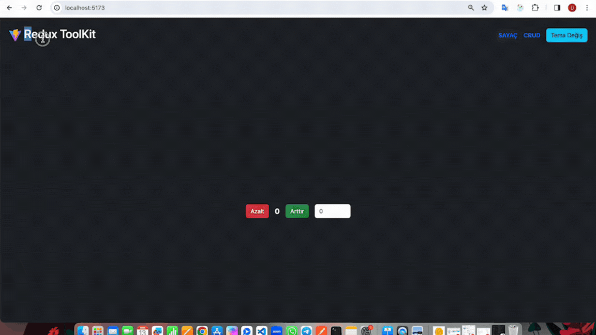

<h1>Redux Toolkit</h1>

Bu proje redux toolkit kullanarak oluşturulmuş bir e-ticaret projesidir.

Kullanılan özellikler;

- React-Redux

- Redux-Toolkit

- React-Router-Dom

Projenin bize sunduğu özellikler;

- Counter için artırma azaltma ve input içerisinden değer belirleme

- Crud için ;

-- Ekeleme

-- Silme

-- Düzenleme

<h2>Kullanılan Diller</h2>

Bu projede React, Redux Redux-Toolkit kullanılmıştır

<h2>Ekran Videosu</h2>

